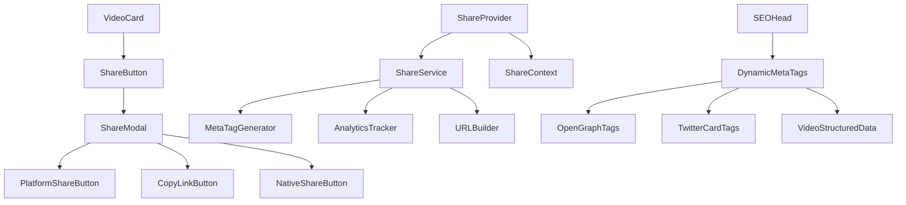

# Requirements Document

## Introduction

This feature will add comprehensive video sharing functionality to the Project Nightfall adult entertainment website. The sharing system will enable users to share videos across multiple social media platforms and messaging services while maximizing engagement, SEO benefits, and website traffic. The implementation will focus on clinical precision with optimized Open Graph meta tags, social media integration, and search engine signals to improve website ranking and visibility.

## Requirements

### Requirement 1

**User Story:** As a user, I want to share videos on social media platforms, so that I can recommend content to friends and increase engagement with the website.

#### Acceptance Criteria

1. WHEN a user clicks the share button on a video THEN the system SHALL display a share modal with multiple platform options
2. WHEN a user selects a social media platform THEN the system SHALL open the platform's sharing interface with pre-populated content
3. WHEN content is shared THEN the system SHALL include optimized Open Graph meta tags for rich previews
4. WHEN a shared link is clicked THEN the system SHALL track the referral source and display the video page with proper SEO metadata

### Requirement 2

**User Story:** As a website owner, I want shared videos to generate SEO signals, so that search engines rank our website higher and increase organic traffic.

#### Acceptance Criteria

1. WHEN a video is shared THEN the system SHALL generate structured data markup (JSON-LD) for video content
2. WHEN shared links are accessed THEN the system SHALL provide complete Open Graph meta tags including og:video, og:image, and og:description
3. WHEN social media crawlers access shared links THEN the system SHALL serve optimized meta tags for each platform (Facebook, Twitter, LinkedIn)
4. WHEN users interact with shared content THEN the system SHALL track engagement metrics for SEO optimization

### Requirement 3

**User Story:** As a user, I want to copy video links directly, so that I can share them through messaging apps or email without platform restrictions.

#### Acceptance Criteria

1. WHEN a user clicks the copy link button THEN the system SHALL copy the video URL to the clipboard
2. WHEN the link is copied THEN the system SHALL show a confirmation message
3. WHEN copied links are accessed THEN the system SHALL display the video with full metadata and sharing options
4. WHEN links are shared via messaging apps THEN the system SHALL provide rich link previews where supported

### Requirement 4

**User Story:** As a website owner, I want to track sharing analytics, so that I can understand which content performs best and optimize engagement strategies.

#### Acceptance Criteria

1. WHEN a user shares a video THEN the system SHALL log the sharing event with platform, video ID, and timestamp
2. WHEN shared links are clicked THEN the system SHALL track referral traffic and source attribution
3. WHEN users engage with shared content THEN the system SHALL measure conversion rates from social traffic
4. WHEN analytics are reviewed THEN the system SHALL provide insights on most shared content and effective platforms

### Requirement 5

**User Story:** As a user, I want sharing to work seamlessly on mobile devices, so that I can easily share content while browsing on my phone or tablet.

#### Acceptance Criteria

1. WHEN a user accesses the share feature on mobile THEN the system SHALL display a mobile-optimized share interface
2. WHEN sharing on mobile THEN the system SHALL utilize native sharing APIs where available
3. WHEN the share modal is opened on mobile THEN the system SHALL be responsive and touch-friendly
4. WHEN sharing via mobile apps THEN the system SHALL provide appropriate deep links and fallbacks

### Requirement 6

**User Story:** As a website owner, I want shared content to comply with platform policies, so that shared links are not blocked or flagged by social media platforms.

#### Acceptance Criteria

1. WHEN generating share content THEN the system SHALL use appropriate, non-explicit preview images
2. WHEN creating share text THEN the system SHALL use platform-appropriate language and descriptions
3. WHEN implementing Open Graph tags THEN the system SHALL follow each platform's specific requirements
4. WHEN content is shared THEN the system SHALL ensure compliance with adult content sharing policies

### Requirement 7

**User Story:** As a user, I want to see sharing options integrated naturally into the video interface, so that sharing feels intuitive and doesn't disrupt my browsing experience.

#### Acceptance Criteria

1. WHEN viewing a video card THEN the system SHALL display a subtle share icon
2. WHEN hovering over the share icon THEN the system SHALL show a tooltip indicating sharing functionality
3. WHEN the share button is clicked THEN the system SHALL open the share modal without navigating away from the current page
4. WHEN sharing is complete THEN the system SHALL close the modal and return focus to the video content

------------
------------

# Design Document

## Overview

The video sharing functionality will be implemented as a comprehensive system that enables users to share video content across multiple platforms while maximizing SEO benefits and user engagement. The design focuses on clinical precision with minimal disruption to existing code, utilizing modern web APIs, optimized meta tags, and platform-specific sharing strategies.

The system will consist of a reusable ShareButton component, a ShareModal for platform selection, dynamic Open Graph meta tag generation, analytics tracking, and mobile-optimized sharing capabilities. All components will be designed to work seamlessly with the existing React/TypeScript architecture.

## Architecture

### Component Architecture



### Data Flow

1. User clicks share button on VideoCard
2. ShareButton triggers ShareModal with video data
3. ShareModal presents platform options and copy link functionality
4. Platform selection triggers ShareService methods
5. ShareService generates optimized URLs and meta content
6. Analytics tracking records sharing events
7. Platform-specific sharing interfaces open with pre-populated content

## Components and Interfaces

### ShareButton Component

```typescript
interface ShareButtonProps {
  video: Video;
  size?: 'sm' | 'md' | 'lg';
  variant?: 'icon' | 'button' | 'floating';
  className?: string;
  showTooltip?: boolean;
}
```

A minimal, unobtrusive button that integrates into existing VideoCard components. Supports multiple sizes and variants to fit different UI contexts.

### ShareModal Component

```typescript
interface ShareModalProps {
  isOpen: boolean;
  onClose: () => void;
  video: Video;
  shareUrl: string;
}

interface SharePlatform {
  id: string;
  name: string;
  icon: React.ComponentType;
  color: string;
  shareUrl: (url: string, title: string, description: string) => string;
  isNativeSupported: boolean;
}
```

A responsive modal that presents sharing options including:
- Major social platforms (Facebook, Twitter, LinkedIn, Reddit)
- Messaging platforms (WhatsApp, Telegram)
- Copy link functionality
- Native Web Share API when available

### ShareService

```typescript
interface ShareService {
  generateShareUrl(videoId: number, platform?: string): string;
  generateMetaTags(video: Video): OpenGraphTags;
  trackShareEvent(videoId: number, platform: string): void;
  copyToClipboard(text: string): Promise<boolean>;
  canUseNativeShare(): boolean;
  shareNatively(shareData: ShareData): Promise<void>;
}

interface OpenGraphTags {
  'og:title': string;
  'og:description': string;
  'og:image': string;
  'og:url': string;
  'og:type': 'video.other';
  'og:video': string;
  'og:video:width': string;
  'og:video:height': string;
  'og:site_name': string;
  'twitter:card': 'player';
  'twitter:title': string;
  'twitter:description': string;
  'twitter:image': string;
  'twitter:player': string;
}
```

### Dynamic Meta Tag System

The system will enhance the existing SEOHead component to dynamically generate platform-specific meta tags based on the current video being viewed. This ensures optimal sharing previews across all platforms.

```typescript
interface VideoMetaData {
  title: string;
  description: string;
  thumbnailUrl: string;
  videoUrl: string;
  duration: string;
  category: string;
  rating: number;
  uploadDate: string;
}
```

## Data Models

### Share Analytics Model

```typescript
interface ShareEvent {
  id: string;
  videoId: number;
  platform: string;
  timestamp: Date;
  userAgent: string;
  referrer?: string;
  sessionId: string;
}

interface ShareMetrics {
  videoId: number;
  totalShares: number;
  platformBreakdown: Record<string, number>;
  clickThroughRate: number;
  conversionRate: number;
  lastShared: Date;
}
```

### Platform Configuration

```typescript
interface PlatformConfig {
  facebook: {
    appId?: string;
    shareUrl: string;
    requiredParams: string[];
  };
  twitter: {
    shareUrl: string;
    maxTitleLength: number;
    hashtagSupport: boolean;
  };
  linkedin: {
    shareUrl: string;
    requiresDescription: boolean;
  };
  whatsapp: {
    shareUrl: string;
    mobileOnly: boolean;
  };
}
```

## Error Handling

### Share Failure Recovery

1. **Native Share API Failures**: Fallback to custom modal with platform buttons
2. **Clipboard API Failures**: Fallback to text selection and manual copy instruction
3. **Platform Sharing Failures**: Show error message with alternative sharing options
4. **Network Failures**: Cache share URLs and retry mechanism

### Content Compliance

1. **Adult Content Filtering**: Use appropriate, non-explicit preview images for social sharing
2. **Platform Policy Compliance**: Implement platform-specific content filtering
3. **Age Verification**: Ensure shared links maintain age gate functionality
4. **Content Warnings**: Add appropriate content warnings to shared descriptions

## Testing Strategy

### Unit Testing

- ShareButton component rendering and interaction
- ShareModal platform button functionality
- ShareService URL generation and meta tag creation
- Clipboard operations and error handling
- Analytics tracking accuracy

### Integration Testing

- End-to-end sharing flow from VideoCard to platform
- Meta tag generation and validation
- Mobile responsive behavior
- Cross-browser compatibility
- Platform-specific sharing validation

### Performance Testing

- Modal loading and rendering performance
- Meta tag generation impact on page load
- Analytics tracking overhead
- Memory usage with multiple share operations

### SEO Testing

- Open Graph tag validation using Facebook Sharing Debugger
- Twitter Card validation using Twitter Card Validator
- LinkedIn sharing preview validation
- Structured data validation using Google Rich Results Test
- Search engine crawling and indexing verification

### Accessibility Testing

- Keyboard navigation through share modal
- Screen reader compatibility
- Focus management and ARIA labels
- Color contrast and visual indicators
- Mobile touch target sizing

### Security Testing

- XSS prevention in generated URLs and meta content
- CSRF protection for analytics endpoints
- Content sanitization for user-generated sharing text
- Privacy compliance for tracking and analytics

## Implementation Phases

### Phase 1: Core Components
- ShareButton component integration
- Basic ShareModal with platform buttons
- Copy link functionality
- Basic analytics tracking

### Phase 2: Enhanced Features
- Native Web Share API integration
- Dynamic meta tag generation
- Mobile optimization
- Advanced analytics dashboard

### Phase 3: SEO Optimization
- Structured data implementation
- Platform-specific meta tag optimization
- Search engine signal enhancement
- Performance optimization

### Phase 4: Analytics and Insights
- Comprehensive sharing analytics
- A/B testing framework for share buttons
- Performance monitoring and optimization
- User behavior analysis